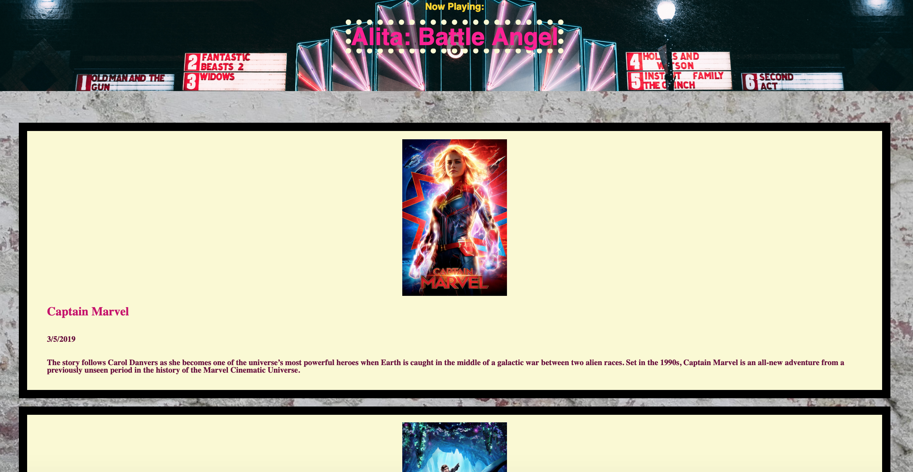

# To The Movies
# Hooked Color Picker

#### To The Movies is a React application that queries The Movie Database API.
#### The project lists movies that have been extracted and displayed on the front end.
#### There is a block for each movie displaying the movie poster image, the movie title, the release date and a description.
#### The header at the top of the page displays a featured film.

## Technology Used:
<!-- [HTML](https://html.com/) want to keep this commented as a reminder. -->
* [HTML](https://developer.mozilla.org/en-US/docs/Web/HTML)
* [CSS](https://developer.mozilla.org/en-US/docs/Web/CSS)
* [React](https://reactjs.org/)
* [Axios](https://www.axios.com/)
* [The Movie DB API](https://www.themoviedb.org/)

## Live Site:
[Production URL](https://to-the-movies-garrettanderson.netlify.com)

